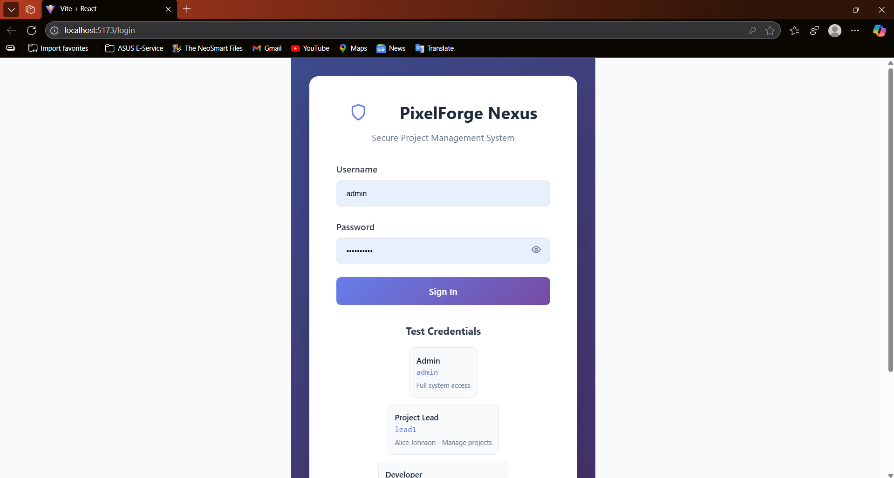
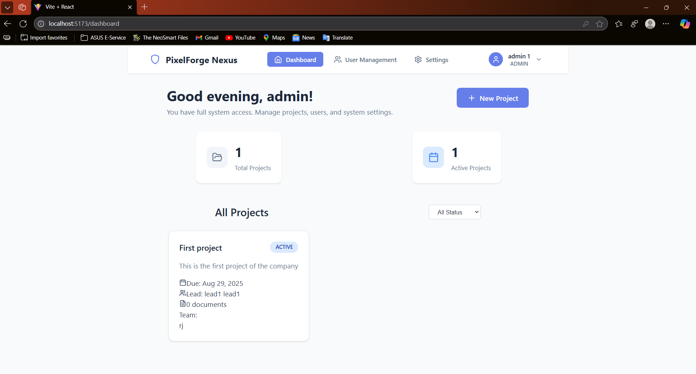
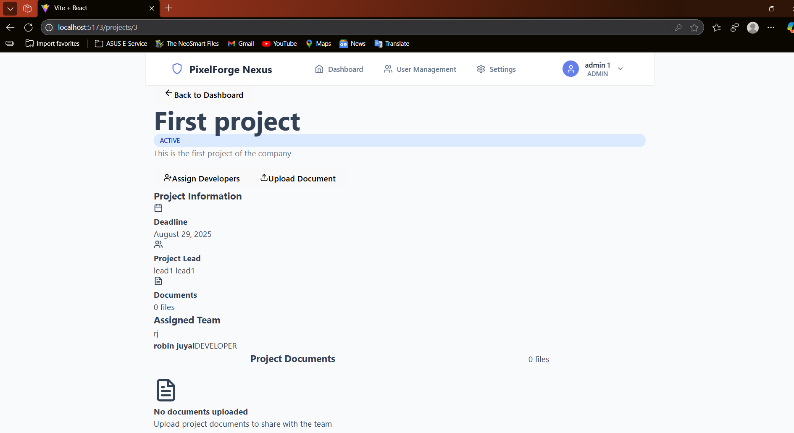
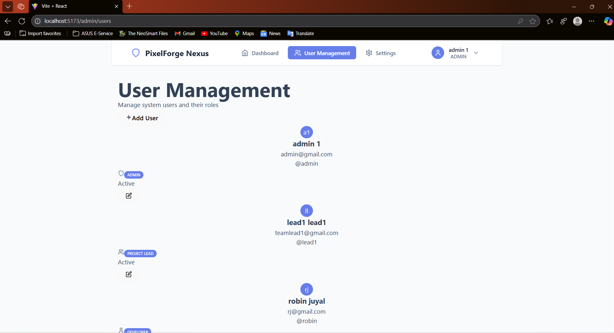

# Description

PixelForge Nexus is a comprehensive secure project management system. The system features role-based access control, secure authentication, project management, team assignments, and document management capabilities.

## 🏗️ System Architecture

- Backend: Spring Boot 3.2.1 with Spring Security
- Frontend: React 18 with modern hooks and context API
- Database: Postgres(PG Admin)
- Authentication: JWT with BCrypt password hashing
- Security: Role-based access control (RBAC)


## Security features  

- JWT Authentication: Secure token-based authentication
- Password Hashing: BCrypt with strength 12
- Role-Based Access Control: Admin, Project Lead, Developer roles
- Input Validation: Server-side validation for all inputs
- File Upload Security: Type validation and size limits
- CORS Configuration: Secure cross-origin resource sharing
- SQL Injection Prevention: JPA/Hibernate with prepared statements`

## User Roles & Permissions
Admin:

- Full system access
- Create/manage projects
- Manage user accounts
- Upload documents to any project
   View all projects and data

Project Lead:

- Manage assigned projects
- Assign developers to projects
- Upload project documents
- View team assignments

Developer:

- View assigned projects
- Access project documents
- Limited read-only access

## Features

- Project Management: Create, update, complete projects
- Team Assignment: Assign developers to specific projects
- Document Management: Secure file upload with type validation
- User Management: Admin-controlled user creation and role management
- Dashboard: Role-based dashboards with relevant information
- Responsive Design: Mobile-friendly interface
## Setup Instructions 
### Prerequisites

- Java 17 or higher
- Node.js 16 or higher
- Maven 3.6 or higher
- Git
### 1> Clone the repository 
```
git clone <repository-url>
cd pixelforge-nexus
```
### 2> Nevigate to backend directory
```
mkdir backend
cd backend
```
### 3> Create the project structure
```
backend/
├── src/
│   └── main/
│       ├── java/
│       │   └── com/
│       │       └── pixelforge/
│       │           └── nexus/
│       │               ├── PixelForgeNexusApplication.java
│       │               ├── config/
│       │               │   ├── DataInitializer.java
│       │               │   └── SecurityConfig.java
│       │               ├── controller/
│       │               │   ├── AuthController.java
│       │               │   ├── UserController.java
│       │               │   ├── ProjectController.java
│       │               │   └── DocumentController.java
│       │               ├── dto/
│       │               ├── entity/
│       │               ├── exception/
│       │               ├── repository/
│       │               ├── security/
│       │               └── service/
│       └── resources/
│           └── application.yml
├── pom.xml
└── uploads/ (created automatically)
```
### 4> Install dependency and run 
```
mvn clean install
mvn spring-boot:run
```
### 5> Frontend project structure should look like 
```
frontend/
├── public/
├── src/
│   ├── components/
│   │   ├── AssignDevelopersModal.js
│   │   ├── CreateProjectModal.js
│   │   ├── Dashboard.js
│   │   ├── DocumentUploadModal.js
│   │   ├── Login.js
│   │   ├── Navigation.js
│   │   ├── ProjectCard.js
│   │   ├── ProjectDetails.js
│   │   └── UserManagement.js
│   ├── contexts/
│   │   └── AuthContext.js
│   ├── services/
│   │   └── api.js
│   ├── App.js
│   ├── App.css
│   └── index.js
├── package.json
└── README.md
```
  
### Application.peroperites file Springboot :-

```

spring.application.name=UMS-backend
spring.datasource.url=jdbc:mysql://localhost:3306/testing
spring.datasource.username=root
spring.datasource.password= your password
spring.jpa.datasource.hibernate.dialect=org.hibernate.dialect.MySQL8Dialect
spring.jpa.hibernate.ddl-auto=update

```

## API endpoints :-
### Authentication
```
- POST /api/auth/login - User login
- GET /api/auth/me - Get current user
- POST /api/auth/refresh - Refresh JWT token

```
### Projects
```
- GET /api/projects - Get user's projects
- POST /api/projects/create - Create project (Admin)
- PUT /api/projects/{id}/assign - Assign developers
- PUT /api/projects/{id}/complete - Mark completed

```
### Documents
```
- POST /api/documents/projects/{id}/upload - Upload document
- GET /api/documents/projects/{id} - Get project documents
- GET /api/documents/{id}/download - Download document

```
### Users
```
- GET /api/users - Get all users (Admin)
- POST /api/users/create - Create user (Admin)
- PUT /api/users/change-password - Change password

```
## Frontend overview :-
- Login


- Dashboard : -


- Project details : -


- User management : -



## Note:
This is a complete, production-ready secure project management system with comprehensive security features and role-based access control. All security best practices have been implemented including JWT authentication, password hashing, input validation, and secure file handling.

# Author 
## Robin Juyal | robinjuyal29@gmail.com | 9548933347


